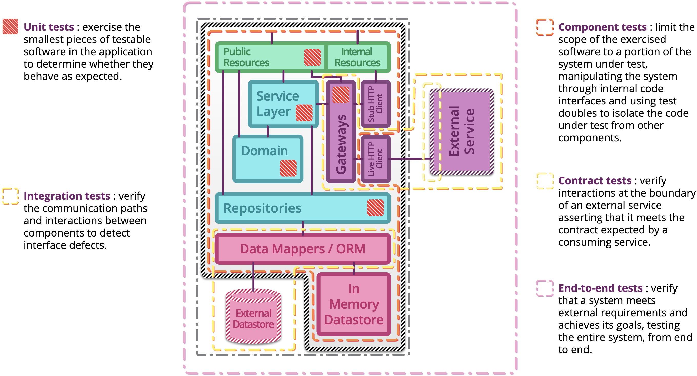
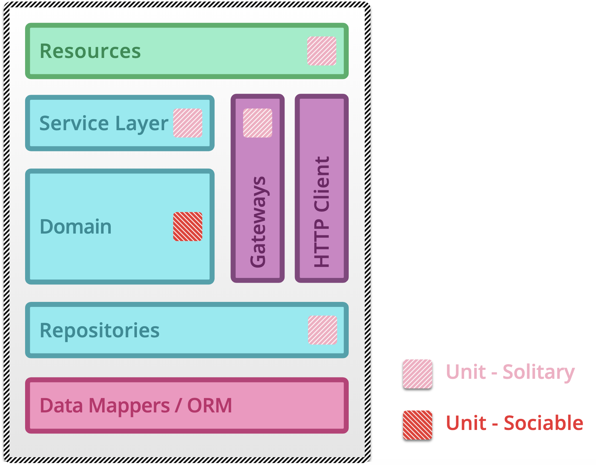

# audio-deidentification
Deidentifying audio files - a new name entity recognition task

**ToDo:** Build Status, Code Coverage, + other badges

## Preview
**ToDo:** Demo GIF

## TOC
1. [Getting Started](#getting-started)
    1. [Accessing the source code](#accessing-the-source-code)
    1. [Prerequisites](#prerequisites)
    1. [Project Structure](#project-structure)
    1. [Backend](#backend)
1. [System Design](#system-design)
1. [Testing](#testing)
    1. [The Importance Of Automation](#the-importance-of-automation)
    1. [Testing Strategy](#testing-strategy)
    1. [Unit Testing](#unit-testing)
1. [Deployment](#deployment)
    1. [Kubernetes](#kubernetes)
1. [Contributing](#contributing)
1. [Author](#author)
1. [License](#license)

## Getting Started

### Accessing the Source Code

```bash
git clone
```

### Prerequisites

- Python v3.6.8
- Poetry

### Project Structure

Describe structure of project in terms of generic folders and poetry (and other python tools) usage

### Backend

## System Design
## Testing

### The Importance Of Automation
SnapBee Figure Extraction is maintained by a small team of talented software engineers studying at Cornell under Cornell Data Science as a side project. The team wants to deliver new features faster without sacrificing its quality. Testing ever-increasing amount of features manually soon becomes impossible — unless we want to spend all our time with manual, repetitive work instead of delivering working features.

Test automation is the only way forward.

### Testing Strategy



Please read [Testing Strategies in a Microservice Architecture](https://martinfowler.com/articles/microservice-testing)
for a detailed introduction on test strategies.

### Unit Testing

A unit test exercises the smallest piece of testable software in the
application to determine whether it behaves as expected.


Run unit tests for backend:

```bash
python -m pytest ...
```

#### Sociable And Solitary



#### The FIRST Principal

- [F]ast: Unit tests should be fast otherwise they will slow down
   development & deployment.
- [I]ndependent: Never ever write tests which depend on other test cases.
- [R]epeatable: A repeatable test is one that produces the same results
   each time you run it.
- [S]elf-validating: There must be no manual interpretation of the results.
- [T]imely/[T]horoughly: Unit tests must be included for every pull request
   of a new feature and cover edge cases, errors, and bad inputs.

#### Test Structure

A automated test method should be composed of 3As: Arrange, Act, and Assert.

- [A]rrange: All the data needed for a test should be arranged as part
  of the test. The data used in a test should not depend on the environment
  in which the test is running.
- [A]ct: Invoke the actual method under test.
- [A]ssert: A test method should test for a single logical outcome.

## Deployment
TBD


## Contributing
Please read [CONTRIBUTING.md](CONTRIBUTING.md) for details on our code
of conduct, and the process for submitting pull requests to us.

## Author

Magd Bayoumi - *Initial work* - []()

As the tech lead of SnapBee Figure Extraction, I am responsible for the overall planning, execution
and success of complex software solutions to meet users' needs.
